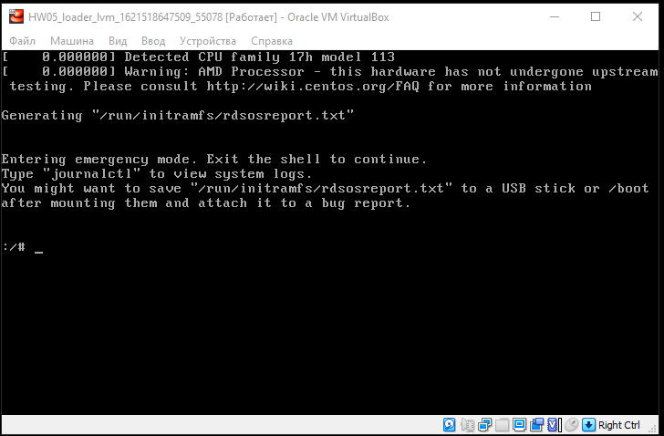

Домашняя работа

Попасть в систему без пароля несколькими способами

Во всех способах нужно также удалять строку `console=ttyS0,115200n8`

Способ 1. `init=/bin/sh`


В конце строки начинающейся с `linux16` добавляем `init=/bin/sh` и нажимаем `сtrl-x` для загрузки в систему

Далее нужно перемонтировать систему в Read-Write режим командой
- `mount -o remount,rw /`

Убедится можно создав файл и записав в него иформацию


Способ 2. `rd.break`

В конце строки начинающейся с `linux16` добавляем `rd.break` и нажимаем `сtrl-x` для загрузки в систему
После загрузки в систему попадаем в emergency mode. Чтобы попасть в корневую файловую систему и сменить пароль админа нужна выполнить следующие команды:

```
mount -o remount,rw /sysroot
chroot /sysroot
passwd root
touch /.autorelabel
```


Способ 3. `rw init=/sysroot/bin/sh`

В конце строки начинающейся с `linux16` заменяем `ro` на `rw init=/sysroot/bin/sh` нажимаем `сtrl-x` для загрузки в систему





Установить систему с LVM, после чего переименовать VG

посмотрим текущее состояние системы:
`vgs`
```
VG          #PV #LV #SN Attr   VSize   VFree
VolGroup00   1   2   0 wz--n- <38.97g    0
 ```

Переименуем:
`vgrename VolGroup00 OtusRoot`

Замнеми старое название на новое в следующих конфигах:
`/etc/fstab` `/etc/default/grub` `/boot/grub2/grub.cfg`

Пересоздадим  initrd image
`mkinitrd -f -v /boot/initramfs-$(uname -r).img $(uname -r)`

Перезагружаемся и проверяем новое имя:
`vgs`
```
VG       #PV #LV #SN Attr   VSize   VFree
OtusRoot   1   2   0 wz--n- <38.97g    0
```

Создадим папку для модуля
`mkdir /usr/lib/dracut/modules.d/01test`

Поместим в нее два скрипта:
`module-setup.sh`
`test.sh`

Дадим им права на выполнение:
`chmod +x module-setup.sh`
`chmod +x test.sh`

Пересоздадим initrd:
`dracut -f -v`

Проверяем загруженные модули в образ:
`lsinitrd -m /boot/initramfs-$(uname -r).img | grep test`

Редактируем `/boot/grub2/grub.cfg`
удаляем опции  `rghb` и `quiet`

Перезагружаемся и наблюдаем пингвина

